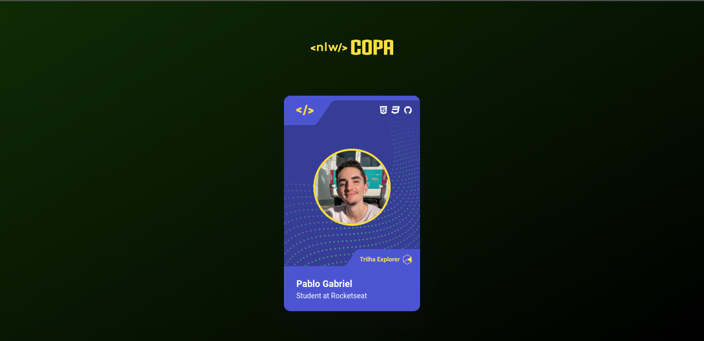

<h1 align="center"> Card NLW Copa </h1>

  🪪 ⚽ Projeto simples feito para aquecimento da NLW Copa.

  <a href="#-tecnologias">Tecnologias</a>&nbsp;&nbsp;&nbsp;|&nbsp;&nbsp;&nbsp;
  <a href="#-projeto">Projeto</a>&nbsp;&nbsp;&nbsp;|&nbsp;&nbsp;&nbsp;
  <a href="#-deploy">Deploy</a>&nbsp;&nbsp;&nbsp;|&nbsp;&nbsp;&nbsp;
  <a href="#-layout">Layout</a>&nbsp;&nbsp;&nbsp;

 

  

## 🚀 Tecnologias

Esse projeto foi desenvolvido com as seguintes tecnologias:

- <strong>
     
      HTML
  </strong>
- <strong>
     
      CSS
  </strong>
- <strong>
      
      Javascript
  </strong>

## 💻 Projeto

O Card NLW Copa é um cartão que simula a famosa figurinha da Copa do Mundo, no estilo da NLW Copa. Clicando no cartão o tema muda de acordo com as trilhas de estudo do evento.

## ✈️ Deploy

Hospedado no Github Pages [NESSE LINK](https://poveii.github.io/nlw-copa-card/).

## 🔖 Layout

Você pode visualizar o layout do projeto através [DESSE LINK](https://www.figma.com/file/XaOA0HyphJxJkAAa5FrbAg/NLW-Copa-Card/duplicate). É necessário ter conta no [Figma](https://figma.com) para acessá-lo.

---

Feito com ❤️ by Poveii!
